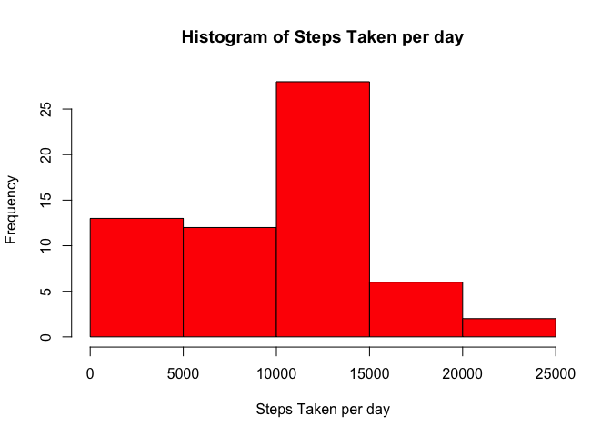
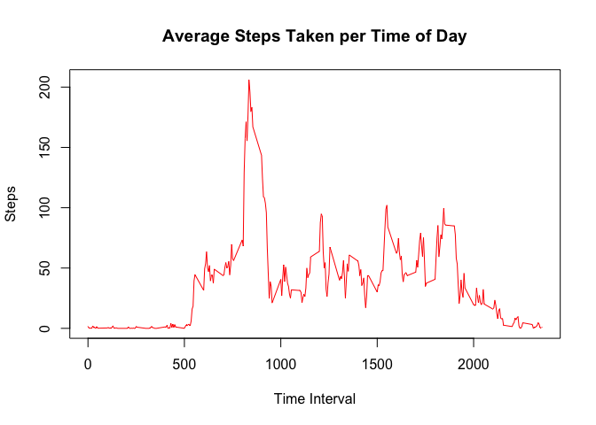
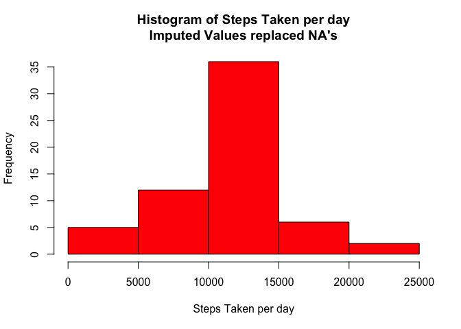
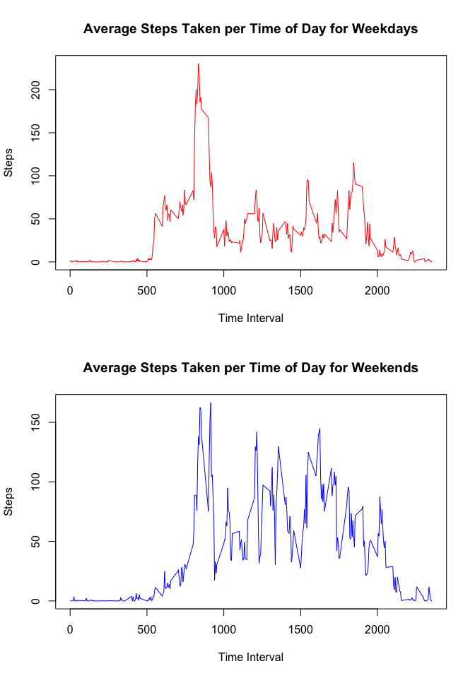

# Reproducible Research: Peer Assessment 1

#Introduction

It is now possible to collect a large amount of data about personal movement using activity monitoring devices such as a [Fitbit](http://www.fitbit.com), [Nike Fuelband](http://www.nike.com/us/en_us/c/nikeplus-fuelband), or [Jawbone Up](https://jawbone.com/up). These type of devices are part of the "quantified self" movement -- a group of enthusiasts who take measurements about themselves regularly to improve their health, to find patterns in their behavior, or because they are tech geeks. But these data remain under-utilized both because the raw data are hard to obtain and there is a lack of statistical methods and software for processing and interpreting the data.

This report makes use of data from a personal activity monitoring device. This device collects data at 5 minute intervals through out the day. The data consists of two months of data from an anonymous individual collected during the months of October and November, 2012 and include the number of steps taken in 5 minute intervals each day.

#Data

The data for this assignment was downloaded from the course web site:

+ Dataset: [Activity monitoring data](https://d396qusza40orc.cloudfront.net/repdata%2Fdata%2Factivity.zip) [52K]

The variables included in this dataset are:

+ **steps**: Number of steps taking in a 5-minute interval (missing values are coded as NA)

+ **date**: The date on which the measurement was taken in YYYY-MM-DD format

+ **interval**: Identifier for the 5-minute interval in which measurement was taken

The dataset is stored in a comma-separated-value (CSV) file and there are a total of 17,568 observations in this dataset.

#Assignment

## Loading and preprocessing the data


```r
data <- read.csv("activity.csv", header = TRUE)
data$date <- as.Date(data$date)
```

## What is mean total number of steps taken per day?
*1. Calculate the total number of steps per day*

```r
##Calculate the number of steps take per day
steps.total <- tapply(data$steps, data$date, sum, na.rm=T)
steps.df <- data.frame(steps.total)
```


*2. Plot a histogram of steps total per day.*

```r
hist(steps.df$steps.total,
     xlab="Steps Taken per day",
     main="Histogram of Steps Taken per day",
     col="red")
```

 

*3. Calculate and report the mean and median of the total number of steps taken per day.*


```r
options(scipen = 5, digits = 2)
meanSteps <- mean(steps.df$steps.total, na.rm = T)
medianSteps <- median(steps.df$steps.total, na.rm = T)
```

The **mean** of the steps taken per day is **9354.23**.
The **median** of steps taken per day is **10395**.


## What is the average daily activity pattern?

*1. Make a time series plot of the 5-minute interval and the average number of steps taken, averaged across all the days.*


```r
##Calculate the average number of steps taken, averaged across all the days
stepsTime <- tapply(data$steps, data$interval, mean, na.rm=T)
time.df <- data.frame(stepsTime)
plot(row.names(time.df), time.df$stepsTime, type = "l", col = "red",
     xlab="Time Interval", ylab="Steps",
     main="Average Steps Taken per Time of Day")
```

 

*2. Which 5-minute interval, on average across all the days in the dataset, contains the maximum number of steps?*

```r
maxTime <- time.df[(time.df$stepsTime == max(time.df$stepsTime)), ]
maxTime <- as.data.frame(maxTime)
```
The time interval **835** contains the maximum number of steps. An average number of 206.17 steps were taken in this time interval.

## Imputing missing values

*1. Calculate and report the total number of missing values in the dataset (i.e. the total number of rows with NAs)*

```r
stepsMissing <- sum(is.na(data$steps))
```
The total number of missing values are **2304**.

*2. Devise a strategy for filling in all of the missing values in the dataset.*

The strategy for imputing missing values is to replace a missing value with the mean for that time interval.

*3. Create a new dataset that is equal to the original dataset but with the missing data filled in.*


```r
##For Loop In Sequences Along Day

##Create new data frame for imputed values & new variable to count through intervals
dataImpute <- data
intervalCount <- 0

##Control Structure to process every row
for(i in 1:17568){
        
        ##Count along time intervals from 1 to 288
        intervalCount <- intervalCount + 1
        if(intervalCount == 289) {intervalCount = 1}

        ##Replace Missing Value with Average Steps for that Time Interval
        if(is.na(data$steps[i])) {
                dataImpute$steps[i] <- time.df[intervalCount, 1]
        }
}
```

*4. Make a histogram of the total number of steps taken each day and Calculate and report the mean and median total number of steps taken per day*

```r
stepsi.total <- tapply(dataImpute$steps, dataImpute$date, sum, na.rm=F)
stepsi.df <- data.frame(stepsi.total)

hist(stepsi.df$stepsi.total,
     xlab="Steps Taken per day",
     main="Histogram of Steps Taken per day\nImputed Values replaced NA's",
     col="red")
```

 

```r
stepsi.mean <- mean(stepsi.df$stepsi.total)
stepsi.median <- median(stepsi.df$stepsi.total)
```
After imputing for missing values, the **mean** steps taken per day is **10766.19**.

After imputing for missing values, the **median** steps taken per day is **10766.19**.

*Do these values differ from the estimates from the first part of the assignment? What is the impact of imputing missing data on the estimates of the total daily number of steps?*

Afer replacing NA's with imputed values, the mean and median for steps taken per day were higher in the dataset.


## Are there differences in activity patterns between weekdays and weekends?

*1. Create a new factor variable in the dataset with two levels -- "weekday" and "weekend" indicating whether a given date is a weekday or weekend day.*

```r
##Define variables for weekend day and weekday days
wknd <- c("Saturday", "Sunday")
wkdy <- c("Monday", "Tuesday", "Wednesday", "Thursday", "Friday")

##Add varaible for day of the week
dataImpute$dayType <- weekdays(dataImpute$date)

##Convert days of the week to either Weekends or Weekdays
for(i in 1:17568){
        if (dataImpute$dayType[i] %in% wknd) {dataImpute$dayType[i] <- "Weekends"}
        if (dataImpute$dayType[i] %in% wkdy) {dataImpute$dayType[i] <- "Weekdays"}
}
```

*2. Make a panel plot containing a time series plot of the 5-minute interval (x-axis) and the average number of steps taken, averaged across all weekday days or weekend days (y-axis).*

```r
 ##Create datasets for Weekday and Weekends
 dataWeekend <- dataImpute[(dataImpute$dayType == "Weekends"),]
 dataWeekday <- dataImpute[(dataImpute$day == "Weekdays"), ]
 
 ##Collapse Dataset across days for weekdays and weekends
 weekdayT <- as.data.frame(tapply(dataWeekday$steps, dataWeekday$interval, mean))
 weekendT <- as.data.frame(tapply(dataWeekend$steps, dataWeekend$interval, mean))
 
 colnames(weekdayT) <- "steps"; colnames(weekendT) <- "steps"
 
 ##Plot for Weekends & Weekdays
 par(mfcol = c(2,1))
 plot(row.names(weekdayT), weekdayT$steps,
      type = "l", col = "red",
      xlab="Time Interval",
      ylab="Steps",
      main="Average Steps Taken per Time of Day for Weekdays")
 plot(row.names(weekendT), weekendT$steps,
      type="l", col="blue",
      xlab="Time Interval",
      ylab="Steps",
      main="Average Steps Taken per Time of Day for Weekends")
```

 
